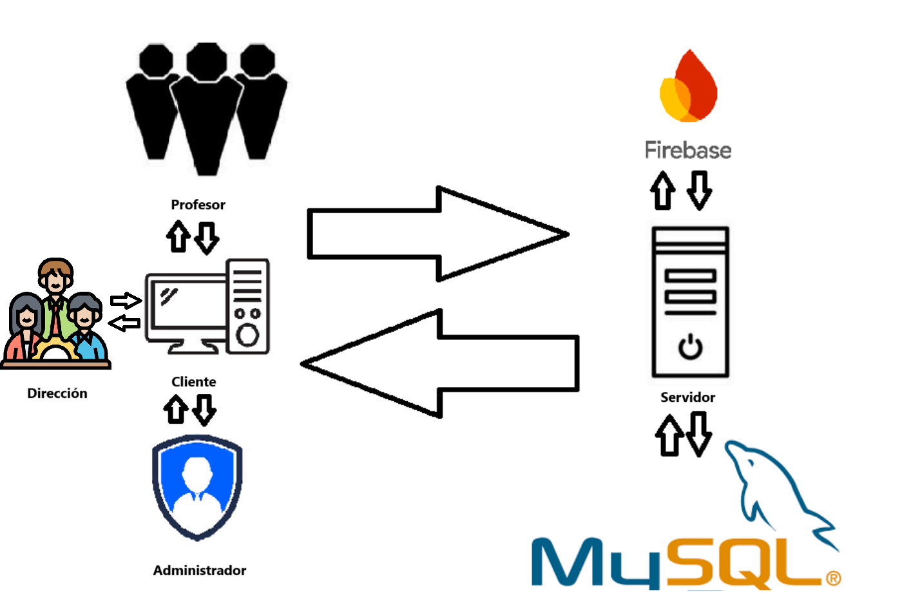

**PROYECTO**

**FIN DE CICLO**

**SCHOOL MANAGER**

**Nombre: Virginia Moreno Ortega y Alejandro Jiménez Bueno**

**Curso Académico:  2024 / 25**

**Profesor tutor del Proyecto :  Francisco Manuel Benítez Chico**

**1.- INTRODUCCIÓN**

Nuestro proyecto es un añadido al entorno Reaktor que tiene como objetivo gestionar las matrículas del alumnado, el agrupamiento de los mismos y la asociación de los profesores a las asignaturas que lo requieren así como las posibles reducciones laborales.

El proyecto SchoolManager, que toma varias dependencias del resto de proyectos que sirven como base para Reaktor, utiliza un servidor web Spring Boot con Java 17 para el backend, almacenando los datos necesarios para su funcionamiento en una base de datos MySQL. Posteriormente tenemos dos pestañas dentro del menú de la web ‘SomosJandula’ hechos con Vue con una serie de vistas  que obtienen sus datos necesarios a través de endpoints al back. Cabe destacar, que para acceder a las funcionalidades de la aplicación, se necesita una cuenta de Google que se loguee mediante **Firebase**, y que cuente con los permisos necesarios para utilizar determinadas funciones.

OBJETIVOS:

- Administrar las matrículas de cada curso y etapa, con opción a adiciones de última hora.

- Declarar las horas a impartir de cada asignatura matriculada por los alumnos.

- Crear grupos para cada curso y repartir a los alumnos en los mismos.

- Asignar departamentos a las asignaturas de cada curso con opción a transferencia de horas disponibles entre departamentos para cumplir cupos.

- Creación y asignación de reducciones de jornada.

- Asignación de profesores a las asignaturas disponibles de su departamento.

**2.- ANÁLISIS**

Para este proyecto es necesario un entorno que lance el servidor web y una aplicación que aloje el cliente, de manera que se establezca la comunicación entre las peticiones del cliente y el backend.

Cada cuenta de Google tendrá acceso a las características permitidas para su rol en la aplicación. Dichas cuentas se obtienen a través de una base de datos propia.

**Vista de matrícula:** La primera vista. Permite cargar archivos CSV con las matrículas del alumnado a un curso y etapa específica seleccionada en un menú.

**Vista de asignaturas y bloques:** Aquí se pueden configurar las horas que se deben impartir de cada asignatura por ley y modificar esa cantidad desde una tabla si es necesario. A través de unas casillas se pueden asignar asignaturas como optativas añadiéndolas a bloques de optativas. Además, si una asignatura no requiere de docencia o si se necesita permitir que tenga distintos profesores se puede marcar como “Sin docencia” o como “Desdoble” según el caso.

**Vista de grupos:** Permite crear grupos en los cursos (A,B,C…) y repartir los alumnos de la vista anterior en ellos como sea necesario. Los grupos de más pueden eliminarse o vaciarse además de seleccionar si se trata de un grupo con horario de mañana o tarde.

**Vista de resumen por asignatura: **En esta vista se puede comprobar el reparto de los alumnos por grupo actual para las distintas asignaturas de un curso, incluidas las optativas que van aparte de los grupos.

**Vista de departamentos: **Esta vista cuenta con dos tarjetas con varias acciones y dos tablas reactivas. Desde una tarjeta podemos asignar las asignaturas a sus respectivos departamentos y movilizar las horas sobrantes de un departamento propietario a uno receptor. Una de las tablas mostrará la información de las asignaturas incluidas en el departamento seleccionado mientras que la otra mostrará en todo momento la información global de los departamentos (cómputo de horas, tamaño de la plantilla modificable, etc.). La otra tarjeta permite modificar la cantidad de profesores en plantilla de un departamento.

**Vista de reducciones: **Desde aquí se crearán los tipos de reducciones y si su aplicación es elegible por la dirección o no. Estas reducciones se podrán aplicar directamente a un profesor desde aquí o desde la última vista.

**Vista de elección de horarios: **Desde esta última vista se pueden acceder a todas las opciones que complementan las vistas anteriores. Desde una tarjeta a la izquierda podemos elegir un profesor para asignarle las asignaturas a impartir y las reducciones que solicita, mostrandolas en una tabla a la derecha que permite además seleccionar un grupo si la asignatura lo permite o eliminar la solicitud. Debajo de los desplegables, a la izquierda, se muestran una serie de opciones para guardar una serie de observaciones que los profesores quieran hacer o preferencias horarias. Esta vista puede accederse como administrador (lo cual permite asignar solicitudes a un profesor de la lista) o como usuario profesor, permitiendo solo realizar solicitudes para uno mismo.

**Vista de administración: **Permite desactivar las funciones de la vista de elección de horarios a través de una constante que permite edición y modificación por parte *solo* del administrador.

Los datos de los que depende la aplicación y los que genera se almacenan en nuestra base de datos **MySQL** siguiendo este esquema:

**3.- DISEÑO**

Al entrar al cliente se da la bienvenida con la pantalla de login:

Una vez logueados correctamente, la interfaz del cliente muestra varias opciones en el menú de la izquierda. En **“Gestión de matrículas”** encontraremos todas las vistas accesibles de nuestro proyecto, a excepción de la última que se encuentra en la pestaña **“Personal”**:** \
**

Algunas de estas vistas pueden no aparecer dependiendo de los **roles** asignados. Un rol ***profesor*** solo podrá ver la pestaña de elección de horarios.

**3.1- CARGA DE MATRÍCULAS:**

La carga de matrículas es el primer servicio que se ofrece, y del que se nutren el resto de los servicios. Funciona eligiendo un **curso** desde el desplegable de la izquierda y arrastrando un archivo con los datos de las matrículas en **CSV**. Si se desea también se puede cargar este archivo haciendo click sobre la zona de selección y buscándolo en el explorador del SO. \
Una vez elegidos ambos campos se habilita el **botón de enviar**, y una vez enviados los cursos con datos cargados aparecen a la derecha. Cada curso tiene su **botón de eliminación** propio que elimina de todas las vistas la información referente a ese curso.

Por último, abajo pueden visualizarse los **datos brutos** de las matrículas cargados para un curso seleccionandolo en el desplegable de abajo y pulsando **‘Cargar CSV**’. Esto mostrará los datos para ese curso en una tabla con las asignaturas y alumnos que además permite modificaciones posteriores por si se producen cambios en las matrículas del curso, incluidas entradas nuevas.

Cada entrada de alumno tiene su botón para eliminarse y, a la derecha en el final de cada fila, un botón para guardar los cambios.

**3.2- ASIGNATURAS Y BLOQUES:**

La segunda vista disponible es la de **asignaturas**. Desde aquí, seleccionando un curso, podemos ver las asignaturas para las cuales los alumnos se han matriculado. Una vez mostradas en la tabla la primera columna permite **seleccionar** varias de ellas simultáneamente, lo que habilita el botón **“Crear bloque”** situado debajo, esto asigna un id de bloque que referencia esas asignaturas de manera que puedan agruparse en **bloques de optativas **como se hace usualmente en bachillerato con el de ciencias o el de tecnología. Esta vista también permite **asignar las horas** necesarias a impartir de cada asignatura, si no tienen **docencia **actualmente y si tienen **desdoble**, es decir, que podrá ser asignar a más de un profesor.

**3.3- CREACIÓN DE GRUPOS:**

La siguiente es la vista de **grupos**, una de las más importantes ya que a través de la creación de grupos podremos realizar el restos de las gestiones posteriores:

Una vez más seleccionamos el **curso** deseado y si tiene datos cargados de la primera vista se nos presentará una **lista con los alumnos** que aún no están en ningún grupo. Si se desea crear un grupo nuevo, es tan sencillo como pulsar el botón de “**Crear grupo**”, esto crea un nuevo grupo vacío por orden alfabético. Los grupos disponibles para el curso aparecerán en el desplegable justo debajo de dicho botón.

Para **añadir un alumno** o varios a un grupo determinado basta con seleccionarlos manualmente, o todos si así desea utilizando el botón de “Seleccionar todo”, elegir un grupo del desplegable y pulsar en “**Añadir alumnos**”. Esto sacará a los alumnos de la lista y los mostrará en la **tabla** de su propio grupo. Cada alumno dispone de un botón para ser **desasignado** y devolverlo a la lista principal o en caso de querer vaciar el grupo se puede hacer con el botón “**Limpiar grupo**” junto al nombre del mismo.

Finalmente, cada grupo tiene una pequeña casilla seleccionable para marcar si se trata de un grupo con** horario de mañana o de tarde.**

**3.4- RESUMEN DE ASIGNATURAS:**

**3.5- ASIGNATURAS Y DEPARTAMENTOS:**

La quinta vista tiene un número variado de funciones repartidas entre tarjetas y  tablas. La tarjeta superior permite elegir el **grupo** de un curso y eso genera una lista de **asignaturas** de ese grupo que **no tienen departamento** asignado. Una vez seleccionada una asignatura se debe seleccionar un **departamento al que asignarla** y un **departamento donante**, esto permite usar el botón de “**Asignar**” haciendo que aparezca en la tabla de su derecha. Esa misma tabla permite **desasignar** la asignatura pulsando el botón rojo, como las tablas anteriores.

La tarjeta inferior permite designar la **plantilla** actual que tiene el departamento que se seleccione en el desplegable de abajo. Este número es importante ya que determina qué cantidad de horas puede cubrir cada departamento. La tabla inferior hace un cálculo teniendo en cuenta este número y muestra cuántas horas le quedan por cubrir a un departamento en la columna de **desfase**. El desfase se calcula restando las *horas totales *menos las *horas necesarias*. Este número puede ser negativo si  faltan horas, positivo si le sobran o 0 si están completamente cubiertos. En caso de que un departamento tenga horas de sobra y este elegido como departamento donante sus horas sobrantes se **cederán** al departamento elegido hasta que o se quede ajustado, o el donante se quede sin horas de sobra.

En la columna de resultado se muestra una frase con un código de color para notificar el estado de ajuste de las horas del departamento.

**3.6- REDUCCIONES:**

Esta vista se encarga de **crear** (parte superior) y asignar (parte inferior) **reducciones** de jornada laboral del profesorado. A la hora de crearlas se debe incluir un **nombre** o motivo, cuántas **horas** posee y si la **elección** de si se aplica o no recae sobre la dirección o no haciendo click en el checkbox. En la tabla de la derecha se muestran siempre las reducciones creadas anteriormente y disponibles para asignar, las cuales pueden ser borradas desde la tabla.

Debajo hay otra tarjeta que permite seleccionar un profesor de una lista en el primer desplegable y una reducción del segundo. Haciéndolo y pulsando en “**Asignar**” quedará asignada la reducción al profesor y podrá verse en la tabla de la derecha, donde aparece cada profesor con su reducción actual. Si se desea desasignar una de estas reducciones basta con pulsar el botón rojo de la entrada a eliminar.

**3.7- ELECCIÓN DE HORARIOS:**

La penúltima vista es la que reúne los datos de las anteriores para poder finalmente **asignar los profesores** a las **asignaturas** que los requieran. Lo primero es elegir un profesor al que asignar datos en el primer desplegable de la izquierda. A partir de ahí se pueden asignar por separado una asignatura del departamento al que pertenece o una **reducción** para la que es elegible. Además debajo de estos botones tendremos la posibilidad de añadir** preferencias**, elegir horas libres y escribir observaciones al equipo directivo con la finalidad de adaptar mejor el horario. \
\
En la tabla de la derecha aparecerán las asignaturas actuales del profesor seleccionado y sus reducciones. Si la entrada o fila en cuestión es una asignatura se podrá hacer click en su celda de **horas y grupo** para elegir cuantas horas de las que necesitan impartirse de esa asignatura va a ocupar el profesor y de qué grupo se va a encargar. Una vez modificado basta con pulsar “**Guardar**” a la derecha. Si se desea eliminar la entrada, tiene un botón dedicado a la izquierda.

En el caso de que el usuario utilizando esta vista no sea alguien con el rol de **ADMINISTRADOR** o **DIRECCIÓN** el desplegable de profesores no aparecerá ya que solo tendrá permitido realizar peticiones para sí mismo.

**3.8- ADMINISTRACIÓN:**

Por último se encuentra la vista de administración. La única finalidad de esta vista, solo accesible por el **administrador**, es **desactivar** la vista de asignación de asignaturas a los profesores. Para ello se habilita una selección de **constantes** a modificar y al seleccionar una se muestra una entrada de texto a rellenar. Si se escribe algo y se guarda este valor pulsando en el botón correspondiente la vista asociada queda bloqueada. Para desbloquearla solo hay que** borrar** la entrada de texto y volver a guardarla.

Esto permite bloquear temporalmente parte de la aplicación si hay algún problema.

**4.- CODIFICACIÓN:**

**Mysql**: Es un sistema gestor de bases de datos relacional y suele utilizarse, como en nuestro caso, para almacenar los datos de diversos servicios web. El esquema de nuestra base de datos es el mostrado anteriormente.

**Git****: **Git es una herramienta que guarda todas las versiones de tu proyecto para que puedas deshacer errores. Permite realizar cambios en tu copia local y compartirlos en un repositorio online con otros colaboradores. Pudiendo realizar distintas ramas que se fusionan entre sí.

**Spring boot**: Es un framework de java de código abierto basado en microservicios y se utiliza para crear los microservicios del backend del servidor.

Este es el orden de la paquetería actual del proyecto:

Las entidades utilizadas para crear las tablas de BBDD y que son modificadas a través de los repositorios son estas:

Varias de estas entidades tienen sus Ids como una entidad embebida aparte, ya que las relaciones entre las tablas necesitan que sean Ids compuestos.

Otras simplemente tienen una relación simple que no necesita de Id compuesto.

**5.- MANUAL DE INSTALACIÓN DE USUARIO**

Para instalar este componente junto con el resto de la app Reaktor basta con seguir la guía de instalación referenciada en la [bibliografía](?tab=t.0#bookmark=kix.xdkwm4pb3z8m).

**6.- CONCLUSIONES**

Nuestro módulo tiene como objetivo agilizar el proceso de gestionar las matrículas y los grupos de los alumnos para quitar trabajo al equipo encargado, y actualmente creemos que lo cumple. Ha sido el proyecto con mayor implicación real de todos en los que hemos participado en estos años.

No ha sido un trabajo fácil, ya que ha requerido de que muchas partes se pongan de acuerdo, muchas consultas al cliente, muchas modificaciones y sobre todo paciencia. Hemos tenido que aprender el uso de estas tecnologías al mismo tiempo que las empleamos lo que lo ha complicado más aún. El uso de Git como tecnología de control de versiones ha sido indispensable.

Esperamos que sirva de apoyo y anime a gente a seguir trabajando y aportando al proyecto.

**7.- TRABAJO FUTURO**

Como trabajo a futuro con este módulo habría algunas mejoras que se podrían implementar:

- Mejorar la forma en que se tratan situaciones excepcionales (Alumnos con el mismo nombre exacto en un grupo).

- Simplificar el código en el back utilizando servicios propios para cada controlador, por ejemplo, creando dtos que agrupen datos para devolver lo que actualmente se está devolviendo en varias peticiones GET distintas, pero de una sola vez, como pasa con las observaciones y las preferencias horarias de los profesores.

- Notificar al alumno cuando se le añade a un grupo y a un profesor cuando se le asigna una asignatura o reducción.

- Simplificar peticiones del frontend eliminando métodos que hagan lo mismo y llevándolos a servicio, por ejemplo, creando métodos que vigilen el cambio de los elementos que se seleccionan en los dropdown, algo que hacemos a menudo en las vistas del front a mano. Así si se quiere hacer algo al modificar algún elemento seleccionado (como cargar una lista al cambiar una selección de profesor) se reduce el código utilizado.

- Generar horarios aceptables en base a los datos generados a partir de las peticiones del profesorado.

- Almacenar la información del componente generada para cada año académico, ya sea, por ejemplo, guardando un histórico en base de datos.

- Contabilizar en el resumen de los grupos por asignatura (Paso 4) cuántos alumnos de cada grupo tiene cada optativa, con el objetivo de saber si dividirlos en grupos o no.

- Mostrar en el resumen de las asignaturas a qué bloque pertenece cada optativa (bien por color, bien mostrando el número de bloque en la fila, concretamente entre paréntesis al lado del número de alumnos por optativa).

- A la hora de las observaciones de la última ventana, si un administrador escribe una observación adicional sobre un profesor que aparezca en un campo aparte debajo de las observaciones llamado “Observaciones de dirección” para diferenciarlo de los escrito por el profesor usuario.

- Exportar a pdf el resumen de las asignaturas de un curso y etapa, y las dos tablas de los departamentos del paso 5.

